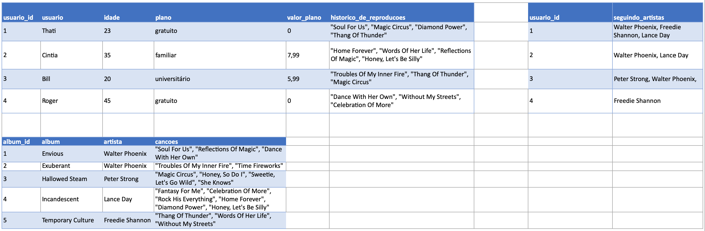

# Problema a ser resolvido

Você receberá uma tabela não normalizada semelhante ao que poderia ser uma versão simplificada do banco de dados do Spotify. O trabalho consistirá de duas partes:

1. Normalizar essa tabela, criar o schema no seu banco de dados local e populá-lo;

2. Realizar os desafios no seu banco normalizado e populado.

**Aviso:** Todos os dados da tabela abaixo são fictícios e foram gerados aleatoriamente através de ferramentas, com o intuito de deixar o projeto mais real para vocês 😉. Quaisquer similaridades com informações reais são meras coincidências.

**Observação:** O banco de dados real do Spotify é muito mais completo e complexo que o mostrado abaixo. No entanto, use APENAS as informações passadas e solicitadas aqui. Não crie dados que não foram solicitados.

## Normalize as tabelas para a 3ª Forma Normal

Abaixo você pode visualizar e baixar uma planilha com as tabelas que deverão ser normalizadas:

[Faça o download dela aqui](./SpotifyClone-Non-NormalizedTable.xlsx)

Antes de tudo, você deverá modelar e normalizar essas tabelas para a 3° Forma Normal. Monte quantas planilhas e tabelas forem necessárias para criar essa versão normalizada, desde que você siga as regras de negócio. Não é necessário criar o código SQL neste momento.

Embora não seja necessário, é recomendado que você crie suas planilhas na sequência 1ª -> 2ª -> 3ª Forma Normal.

Caso haja dúvidas, consulte o material já passado até hoje para te auxiliar.

Seu banco de dados deve seguir as regras de negócio e ser capaz de recuperar:

* Informações sobre quais planos estão disponíveis e seus detalhes;
  * Cada pessoa usuária pode possuir apenas um plano.

* Informações sobre todos as pessoas artistas;
  * Uma pessoa artista pode ter vários álbuns;
  * Uma pessoa artista pode ser seguida por várias pessoas usuárias.

* Informações sobre todos os álbuns de cada artista;
  * Para fins deste projeto, considere que cada álbum possui apenas uma pessoa artista como principal;
  * Cada álbum possui várias canções.

* Informações sobre todas as canções de cada álbum;
  * Para fins deste projeto, considere que cada canção está contida em apenas um álbum.

* Informações sobre todas as pessoas usuárias, seus planos, seu histórico de reprodução e pessoas artistas seguidas.
  * Uma pessoa usuária pode possuir apenas um plano;
  * Cada música do histórico de reprodução pode aparecer uma única vez por pessoa (para simplificar, considere que o objetivo do histórico é saber **quais** canções já foram reproduzidas e **não quantas vezes** foram reproduzidas);
  * Uma pessoa usuária pode seguir várias pessoas artistas, mas cada pessoa artista pode ser seguida apenas uma vez por pessoa usuária.